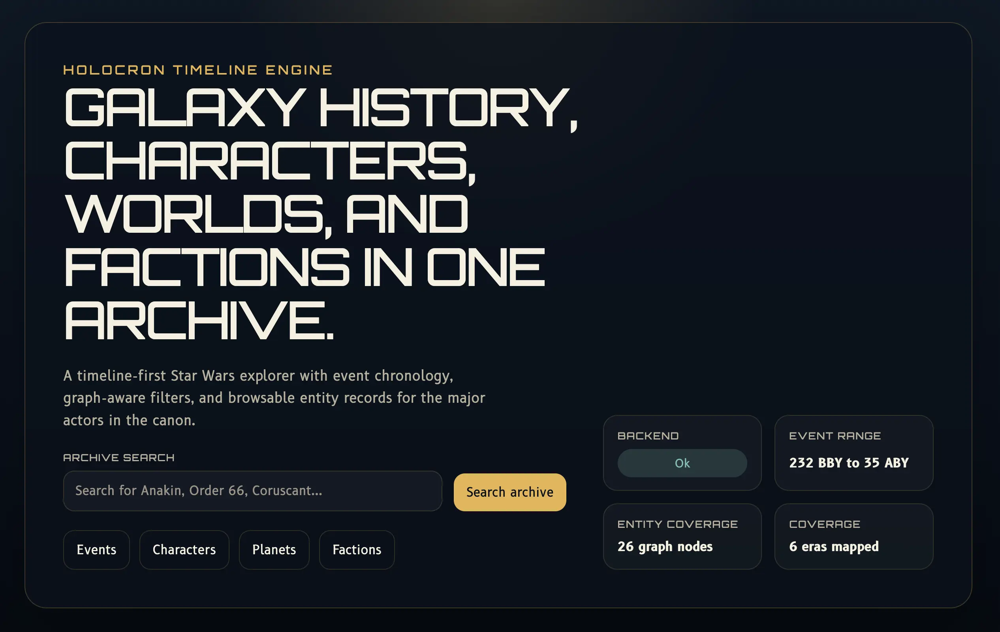
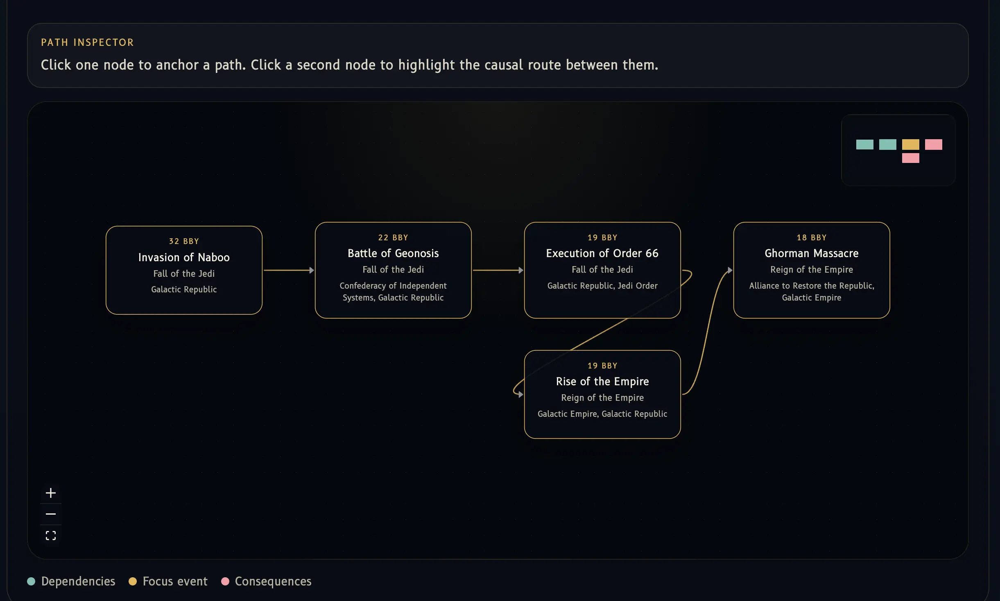
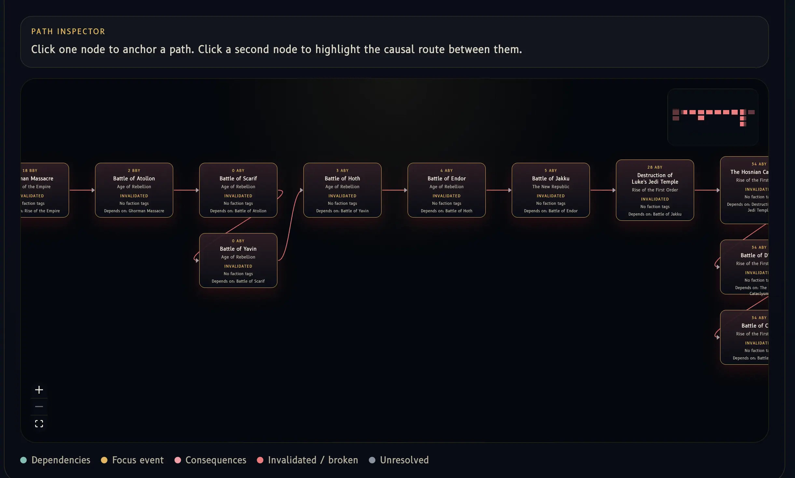
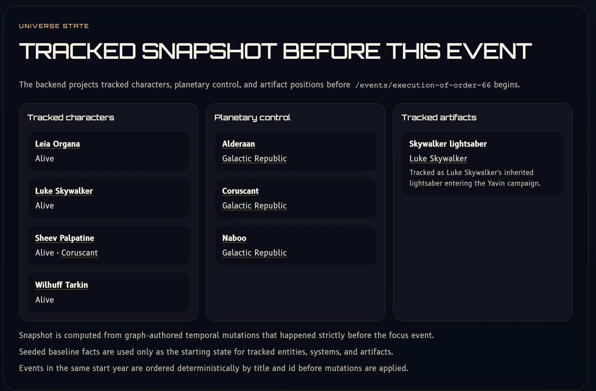

# Holocron Timeline Engine

I built this as a causal timeline system for a fictional universe, using Star Wars data as the working dataset. The core idea is simple: events are nodes, causal links are edges, and the backend can answer questions like "what had to happen before this?" or "what breaks if this event never happens?"

The stack is Next.js on the frontend, FastAPI in the backend, and Neo4j as the graph store. The frontend is mostly a thin client over the API. The backend owns chronology normalization, traversal rules, relationship validation, break simulation, and world-state reconstruction.

## What it does

- Lists events on a timeline with filters for era, character, location, and date range
- Traverses upstream dependencies and downstream consequences through `CAUSES` edges
- Renders event-focused causal graphs
- Runs a what-if simulation by breaking one event and propagating the effect through the downstream graph
- Reconstructs world state before a selected event by replaying prior state-changing relationships

## Project structure

- `frontend/` contains the Next.js UI
- `backend/app/api/` contains FastAPI routes
- `backend/app/engine/` contains the actual application logic
- `backend/app/repositories/neo4j/` contains Cypher-backed persistence code
- `docs/architecture.md` explains system mechanics and scaling behavior
- `docs/api.md` documents the API surface

Request flow:

`Next.js UI -> FastAPI routes -> engine services -> Neo4j repositories -> Neo4j`

## Screens






## Run it locally

```bash
docker compose -f docker/compose.yml up --build
```

Local endpoints:

- Frontend: `http://localhost:3000`
- Backend: `http://localhost:8000`
- OpenAPI docs: `http://localhost:8000/docs`
- Neo4j Browser: `http://localhost:7474`

## Data and tests

Transform and ingest data:

```bash
uv run python scripts/transform.py
uv run python scripts/ingest.py
```

Backfill curated state-changing event history:

```bash
cd backend
python -m app.scripts.backfill_temporal_mutations --dry-run
python -m app.scripts.backfill_temporal_mutations
```

Run tests:

```bash
cd backend
pytest
```

Focused simulation stress test:

```bash
cd backend
pytest tests/unit/engine/test_chaos_simulation.py
```

## Further reading

- [docs/architecture.md](docs/architecture.md)
- [docs/api.md](docs/api.md)
- [docs/engineering-design.md](docs/engineering-design.md) for system behavior, tradeoffs, scaling limits, and the event-detail flow
