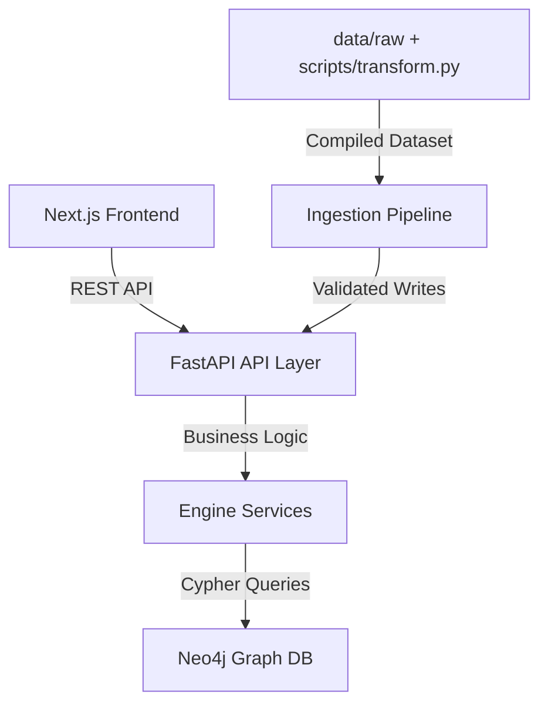

# Architecture

## Overview

Holocron Timeline Engine is a graph-based system for modeling and simulating causal timelines.

- `frontend/` is a Next.js UI for search, timeline browsing, graph exploration, and what-if simulation
- `backend/app/api/` exposes FastAPI routes under `/api/v1`
- `backend/app/engine/` contains business logic for traversal, simulation, relationships, and universe-state projection
- `backend/app/repositories/neo4j/` translates engine operations into Cypher
- Neo4j is the persistent graph store and source of truth

Request flow:

`Frontend -> FastAPI routes -> engine services -> Neo4j repositories -> Neo4j`

## Architecture Diagrams



### HLD

```text
+-------------------+       +-------------------+       +-------------------+
| Next.js Frontend  | ----> | FastAPI API Layer | ----> | Engine Services   |
+-------------------+       +-------------------+       +-------------------+
                                                              |
                                                              v
                                                     +-------------------+
                                                     | Neo4j Repositories|
                                                     +-------------------+
                                                              |
                                                              v
                                                     +-------------------+
                                                     | Neo4j Graph Store |
                                                     +-------------------+
```

### LLD

```text
frontend/app + components
        |
        v
backend/app/api/routes
        |
        v
backend/app/engine/services
        |
        v
backend/app/repositories/interfaces
        |
        v
backend/app/repositories/neo4j
        |
        v
backend/app/domain + backend/app/schemas
```

## Core Model

### Node Types

- `Event`
- `Character`
- `Planet`
- `Faction`

### Relationship Types

- Structural: `CAUSES`, `INVOLVES`, `LOCATED_IN`, `MEMBER_OF`, `ALLIED_WITH`, `ENEMY_OF`
- State-changing: `SETS_ALIVE_STATE`, `SETS_CHARACTER_LOCATION`, `SETS_PLANET_CONTROL`, `SETS_ARTIFACT_LOCATION`

The structural edges describe chronology and archive semantics. The `SETS_*` edges let events modify world state over time.

## System Mechanics

### Chronology Normalization

Chronology is stored as signed integers:

- `32 BBY` -> `-32`
- `4 ABY` -> `4`
- `0 ABY` -> `0`

This keeps filtering, sorting, traversal, and mutation replay on one numeric axis.

### Zero-Boundary Behavior

Cross-boundary events are stored as normal intervals:

- `1 BBY -> 1 ABY` becomes `start_year = -1`, `end_year = 1`

Display chronology has no historical year zero, but the engine deliberately keeps a mathematical `0` internally so:

- interval math stays continuous
- comparisons and indexing do not need boundary-specific rules
- replay and offset calculations do not need BBY/ABY special cases

`0` is an internal scalar convenience, not a canonical calendar claim.

## Data Model Diagram

```text
(Event)-[:CAUSES]->(Event)
(Event)-[:INVOLVES]->(Character)
(Event)-[:INVOLVES]->(Faction)
(Event)-[:LOCATED_IN]->(Planet)
(Character)-[:LOCATED_IN]->(Planet)
(Character)-[:MEMBER_OF]->(Faction)
(Faction)-[:ALLIED_WITH]->(Faction)
(Faction)-[:ENEMY_OF]->(Faction)

(Event)-[:SETS_ALIVE_STATE]->(Character)
(Event)-[:SETS_CHARACTER_LOCATION {subject_node_id=Character}]->(Planet)
(Event)-[:SETS_PLANET_CONTROL {subject_node_id=Planet}]->(Faction)
(Event)-[:SETS_ARTIFACT_LOCATION {artifact_key=...}]->(Character|Planet)
```

## Simulation Engine

`TimelineSimulationService` powers `GET /api/v1/engine/simulate-break/{event_id}`.

### Inputs

- selected event
- downstream causal subgraph
- dependency metadata for affected events

### Processing

The engine:

1. marks the selected event as `broken`
2. computes a topological order over the downstream subgraph
3. evaluates each event from its dependency status
4. marks nodes as `invalidated` or `unresolved` when support collapses or becomes partial

### Output

The response returns:

- simulation nodes with status and dependency counts
- causal edges
- topological order

The frontend renders canonical and simulated states in one React Flow canvas and reruns layout over the active dataset instead of mounting separate graphs.

## Scaling Characteristics

The backend does not maintain a global in-memory graph cache.

- Neo4j is the source of truth
- FastAPI instances are stateless with respect to graph topology
- traversals run through Cypher queries
- simulation logic runs on request-scoped subgraphs

### Why This Helps

- horizontal scaling is simpler
- cross-instance graph synchronization is not required
- writes become visible through subsequent Neo4j reads

### Main Bottlenecks

- deep traversal cost in Neo4j
- larger payloads for graph and simulation endpoints
- Python post-processing on returned subgraphs
- frontend rendering cost for dense node and edge sets

### Likely Upgrade Paths

- tighter depth and result-size limits
- more aggressive Cypher tuning and indexing
- precomputed summaries for hot graph views
- Neo4j Graph Data Science for heavier analysis
- Redis or pub/sub only if shared in-memory graph materializations are introduced later

## Mutation and Universe State

Events can modify world state without storing snapshots directly on nodes.

### Mutation Rules

`RelationshipService` validates writes before Neo4j persistence:

- endpoints must exist
- unsupported source/target combinations are rejected
- self-referential edges are rejected
- duplicate edges are rejected
- `CAUSES` edges cannot introduce cycles
- `CAUSES` edges cannot violate chronology
- symmetric relationships are normalized to a stable endpoint order

### Universe-State Reconstruction

`UniverseStateService` reconstructs the world before a focus event by combining:

- curated baseline state
- prior events
- prior `SETS_*` mutations

It replays mutations in chronology order to derive:

- character alive/location state
- faction control by planet
- artifact holder or location

### Checkpoints

Universe-state reads use process-local checkpoints at era boundaries so repeated requests replay only the remaining mutation delta.

Tradeoff:

- warm reads get faster
- cache is local to one FastAPI instance
- multi-instance coordination would need extra invalidation only if stronger distributed cache coherence becomes necessary

### Backfill

Curated state history is loaded through `TemporalMutationBackfillService`, which resolves slugs and writes through the same validation path as the API.

## Repository and Data Flow

- `Neo4jEventRepository` handles event listing, traversal, causal graph assembly, impact analysis, and break-simulation graph queries
- `Neo4jGraphRepository` stores relationships, validates references, runs search, and lists prior state mutations
- character, planet, and faction repositories support entity lookup and creation

Data import stays outside the HTTP layer:

- `scripts/transform.py` compiles archive data
- `scripts/ingest.py` loads the transformed dataset
- `scripts/seed/init_schema.cypher` initializes Neo4j schema
- `scripts/audit/relationship_integrity.cypher` audits graph integrity

## Example Queries

```cypher
MATCH (source:Event)-[:CAUSES*1..]->(target:Event {id: $event_id})
RETURN DISTINCT source
ORDER BY source.start_year ASC, source.title ASC
```

```cypher
MATCH (source:Event {id: $event_id})-[:CAUSES*1..]->(target:Event)
RETURN DISTINCT target
ORDER BY target.start_year ASC, target.title ASC
```

```cypher
MATCH (focus:Event {id: $event_id})
MATCH (source:Event)-[r]->()
WHERE type(r) IN [
  "SETS_ALIVE_STATE",
  "SETS_CHARACTER_LOCATION",
  "SETS_PLANET_CONTROL",
  "SETS_ARTIFACT_LOCATION"
]
RETURN properties(r) AS relationship
```
